# DevOps Task Manager

A simple DevOps project that shows how to build, run, deploy, monitor, log, secure, and troubleshoot a small web application using Docker, PostgreSQL, Redis, Nginx, Jenkins, Prometheus, Grafana, and Loki.

The project contains a frontend, a backend, Redis, PostgreSQL, a reverse proxy, CI/CD, monitoring, logging, and troubleshooting steps.

---

## 1. Project Overview

The application is a simple **Task Manager**.

Users can:

- View tasks
- Add a new task
- Delete a task
- Check application health

The main goal of the project is not the business logic. The main goal is to show a complete DevOps setup from source code to deployment and monitoring.

### Main technologies used

| Part | Technology |
|---|---|
| Frontend | React + Nginx |
| Backend | Python Flask |
| Database | PostgreSQL 18 on Linux VM |
| Cache / Service | Redis 7 |
| Containers | Docker |
| Container management | Docker Compose |
| Reverse proxy | Nginx |
| Version control | Git + GitHub |
| CI/CD | Jenkins |
| Monitoring | Prometheus + Grafana + cAdvisor |
| Logging | Loki + Grafana |
| Operating system | Linux Ubuntu |

> **Screenshot 1 — Project folder and files**  
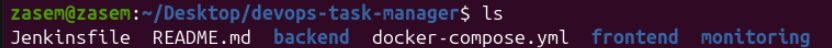

---

# 2. Architecture

The project uses a mixed setup. The application services run in Docker, while PostgreSQL is installed directly on the Linux VM as required.

```text
                         User / Browser
                               |
                               v
                    http://devops.local
                               |
                               v
                         Nginx :80
                       Reverse Proxy
                       /          \
                      /            \
                     v              v
              Frontend           Backend
              :8080              :5000
                                   |
                         +---------+---------+
                         |                   |
                         v                   v
                  PostgreSQL            Redis
                   VM :5432           Container :6379

        Monitoring:
        Prometheus ---> Grafana
             |
             +---- NodeExporter / application metrics

        Logging:
        Containers ---> Loki ---> Grafana

        CI/CD:
        GitHub ---> Jenkins ---> Docker Build ---> Deployment
```

### Important design point

PostgreSQL is **not containerized**.

It runs directly on the Linux VM:

```text
PostgreSQL on Linux VM
       ^
       |
       | host.docker.internal:5432
       |
Backend container
```

Redis is containerized:

```text
Backend container
       |
       | redis:6379
       v
Redis container
```

> **Screenshot 2 — Architecture / running containers**  
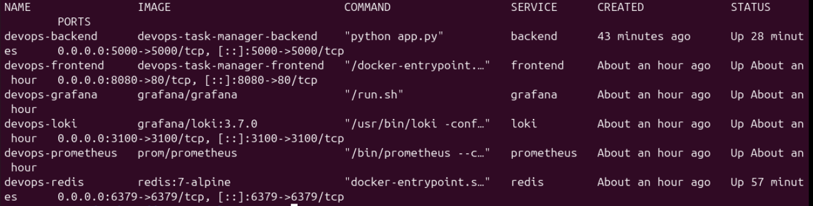
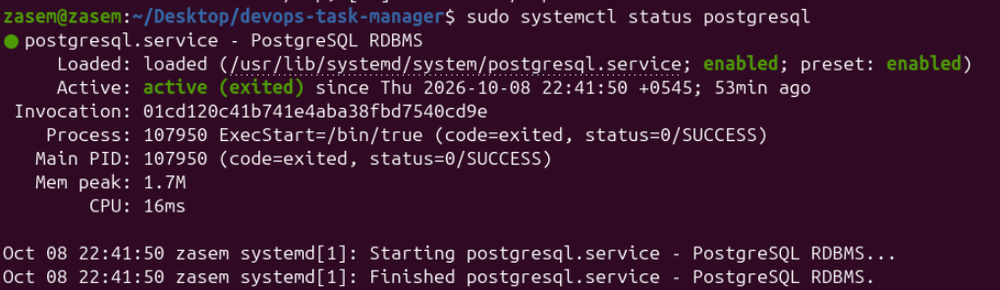

---

# 3. Application & Version Control

## 3.1 Frontend

A simple React frontend was created for the Task Manager application.

The frontend is built for production and served using Nginx inside a Docker container.

Main frontend responsibilities:

- Display the task list
- Send requests to the backend API
- Provide a simple user interface
- Run behind the main Nginx reverse proxy

## 3.2 Backend

A Flask backend was created to provide the API.


The health endpoint checks:

- Backend status
- PostgreSQL connection
- Redis connection

Example:

```bash
curl http://localhost:5000/api/health
```
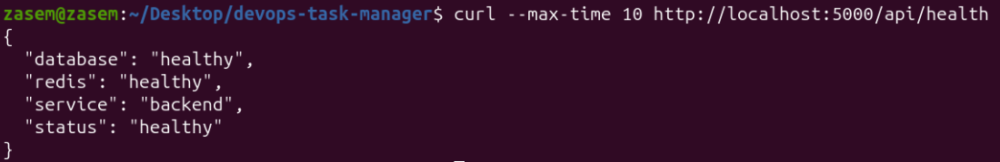
A successful result is similar to:

```json
{
  "database": "healthy",
  "redis": "healthy",
  "service": "backend",
  "status": "healthy"
}
```

> **Screenshot 3 — Frontend working**  
>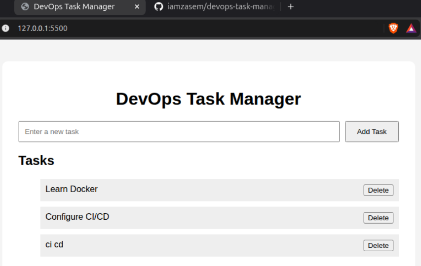

> **Screenshot 4 — Backend API**  
>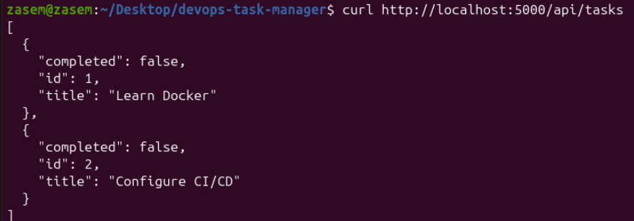
>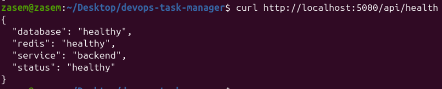

## 3.3 Git repository

The source code was placed under Git version control and pushed to GitHub.

Basic Git flow used:

```bash
git init
git add .
git commit -m "Initial project deployment"
git branch -M main
git remote add origin <https://github.com/iamzasem/devops-task-manager-app.git>
git push -u origin main
```

The repository contains the application source code, Docker files, Compose configuration, Jenkins pipeline, and monitoring configuration.

Sensitive configuration is kept outside Git.

> **Screenshot 5 — GitHub repository**  
>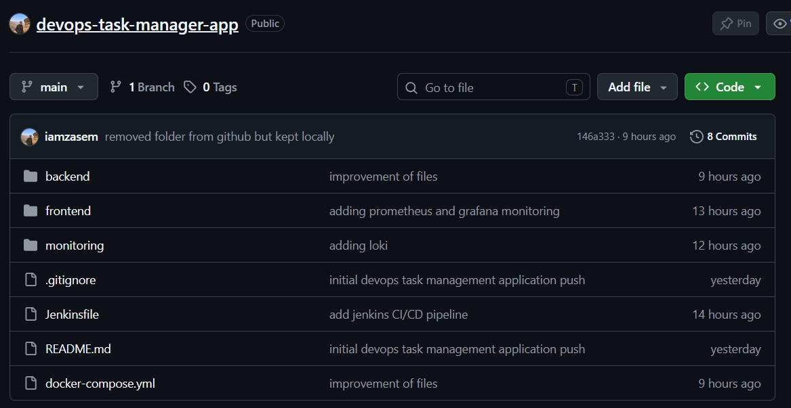

---

# 4. Containerization

## 4.1 Backend Dockerfile

A Dockerfile was created for the Flask backend.

The image installs the Python requirements and starts the Flask application.

Example structure:

```text
backend/
├── Dockerfile
├── app.py
└── requirements.txt
```

The backend container listens on port `5000`.

## 4.2 Frontend Dockerfile

A Dockerfile was created for the React frontend.

The frontend is built and served through Nginx.

Example structure:

```text
frontend/
├── Dockerfile
├── package.json
└── source files
```

The frontend is exposed on port `8080` on the host.

## 4.3 Redis container

Redis is provided by the official Redis image:

```yaml
redis:
  image: redis:7-alpine
```

Redis listens on port `6379`.

## 4.4 Docker Compose

Docker Compose is used to manage:

- Backend
- Frontend
- Redis
- Prometheus
- Grafana
- Loki

PostgreSQL is intentionally not included in Compose.

Main command:

```bash
docker compose up -d --build
```

Check running services:

```bash
docker compose ps
```

Stop services:

```bash
docker compose down
```

> **Screenshot 6 — Docker Compose running**  

---

# 5. Database & Redis

## 5.1 PostgreSQL on the Linux VM

PostgreSQL was installed directly on the Linux server/VM.

The PostgreSQL service is managed by systemd:

```bash
sudo systemctl status postgresql
```

The database used by the project is:

```text
devops_task_manager
```

The application database user is:

```text
devops_user
```

The database is not stored in a Docker container.

Check the database from the VM:

```bash
sudo -u postgres psql
```

List databases:

```sql
\l
```

List users:

```sql
\du
```

## 5.2 Backend PostgreSQL configuration

The backend uses environment variables instead of putting credentials in the source code.

Example `.env` settings:

```env
POSTGRES_DB=devops_task_manager
POSTGRES_USER=devops_user
POSTGRES_PASSWORD=<************>
DB_HOST=host.docker.internal
DB_PORT=5432
```

Docker Compose loads these values into the backend container.

The backend connects to PostgreSQL using:

```text
host.docker.internal:5432
```

This allows a Docker container to reach PostgreSQL running on the Linux VM.

## 5.3 Redis configuration

Redis is connected to the backend using the Docker service name:

```env
REDIS_HOST=redis
REDIS_PORT=6379
```

The backend can test Redis with a ping operation.

Example:

```bash
docker exec devops-backend python -c "import redis; r=redis.Redis(host='redis', port=6379); print(r.ping())"
```

A successful result is:

```text
True
```

> **Screenshot 7 — PostgreSQL service and database**  


> **Screenshot 8 — Redis working**  
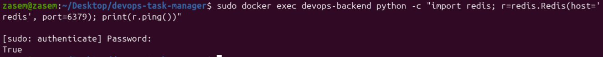
---

# 6. Nginx & Networking

## 6.1 Nginx reverse proxy

Nginx is used as the main reverse proxy for the application.

The routing is:

```text
/       -> Frontend
/api    -> Backend
```

This means the user only needs one main address instead of using separate application ports directly.

Nginx configuration:
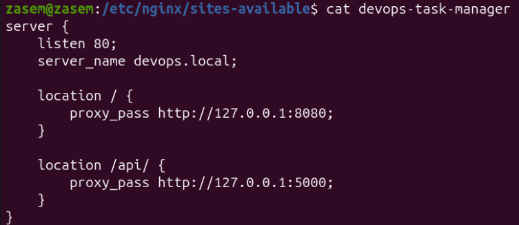


The exact location of the active site configuration is under:

```text
/etc/nginx/sites-available/
/etc/nginx/sites-enabled/
```

Check Nginx configuration:

```bash
sudo nginx -t
```

Reload Nginx:

```bash
sudo systemctl reload nginx
```

## 6.2 Local hostname

The local hostname was configured using `/etc/hosts`.

Example:

```text
127.0.0.1 devops.local
```

After this, the application is accessed with:

```text
http://devops.local
```

## 6.3 Network flow

```text
Browser
   |
   | http://devops.local
   v
Nginx :80
   |
   +---- / ------> Frontend :8080
   |
   +---- /api ---> Backend :5000
                       |
                       +----> Redis :6379
                       |
                       +----> PostgreSQL VM :5432
```

> **Screenshot 9 — Nginx configuration**  
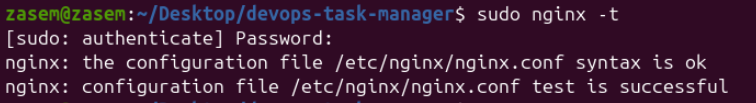

> **Screenshot 10 — devops.local in browser**  
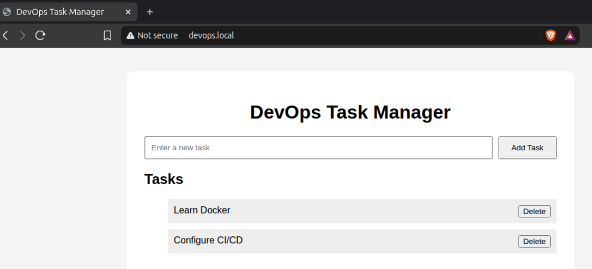

---

# 7. CI/CD with Jenkins

Jenkins was used to create an automated CI/CD pipeline.

The source code is stored in GitHub, and a code push triggers Jenkins through the GitHub webhook.

## 7.1 Pipeline flow

```text
Developer pushes code
        |
        v
      GitHub
        |
        | Webhook
        v
     Jenkins
        |
        +--> Checkout source code
        |
        +--> Build backend Docker image
        |
        +--> Build frontend Docker image
        |
        +--> Verify Docker images
        |
        +--> Deploy latest application
        |
        v
    Application
```

## 7.2 Jenkins pipeline stages

The Jenkinsfile contains stages for:

1. **Checkout** – gets the latest source code from GitHub.
2. **Build Backend Image** – builds the backend Docker image.
3. **Build Frontend Image** – builds the frontend Docker image.
4. **Verify Images** – checks that the built Docker images exist.
5. **Deploy CloudShop / application** – starts the new version of the application.

## 7.3 Automatic trigger

A GitHub webhook was configured in Jenkins so that a new push can automatically start the pipeline.

The Jenkins job can also be started manually when needed.

Useful Jenkins file:

```text
Jenkinsfile
```


---

# 8. Monitoring with Prometheus and Grafana

Monitoring was added so the application and server can be checked using metrics instead of only looking at the application screen.

## 8.1 Prometheus

Prometheus collects metrics and stores them so they can be viewed in Grafana.

Prometheus configuration is stored under:

```text
monitoring/prometheus.yml
```

Prometheus runs on the VM and is connected to the monitoring setup.

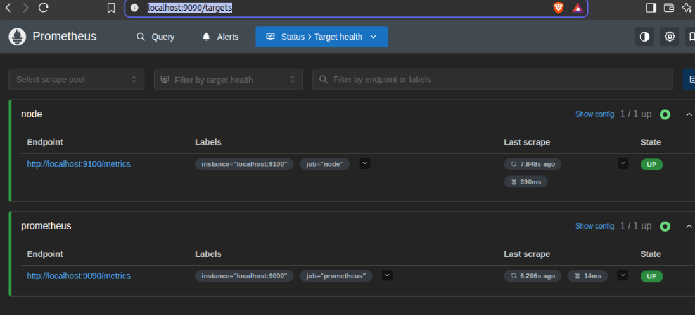


## 8.2 Grafana

Grafana is used to display the collected metrics in dashboards.

Grafana was used to view resource and application information such as:

- CPU usage
- Memory usage
- Disk usage
- Network activity

Grafana is available locally through the configured server port.
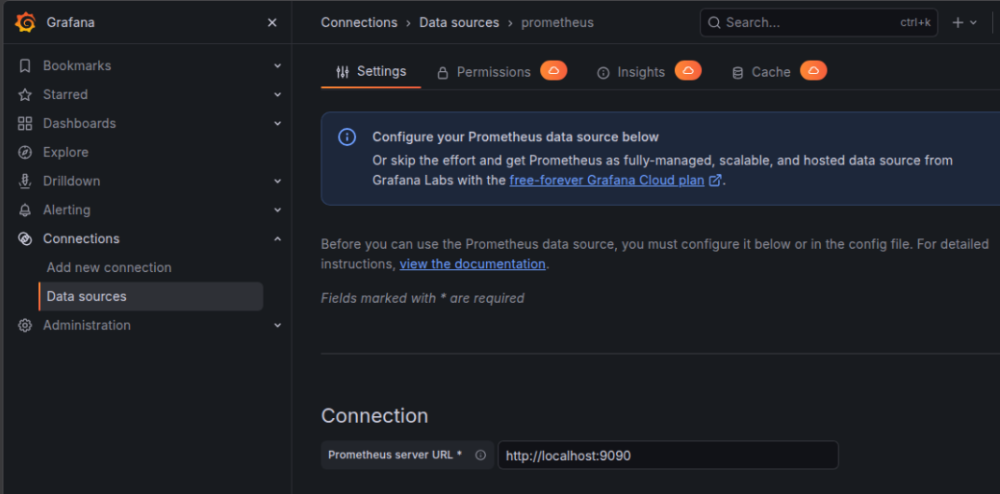
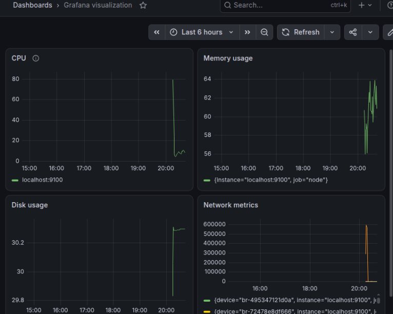


# 9. Logging with Loki and Grafana

Loki was configured to collect application and container logs.

Docker logging was connected to Loki using the Docker Loki logging driver.


Grafana was then connected to Loki as a data source so application logs can be searched and viewed from Grafana.

## Logging flow

```text
Application containers
        |
        v
Docker logs
        |
        v
      Loki
        |
        v
     Grafana
```

This makes it easier to:

- Search application logs
- Check recent activity
- Find messages from containers
- Match logs with monitoring data

Loki configuration is stored under:

```text
monitoring/loki-config.yaml
```


> **Screenshot 16 — Grafana Loki data source**  
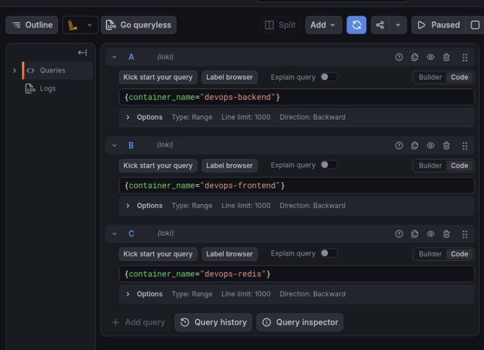

> **Screenshot 17 — Application logs in Grafana**  
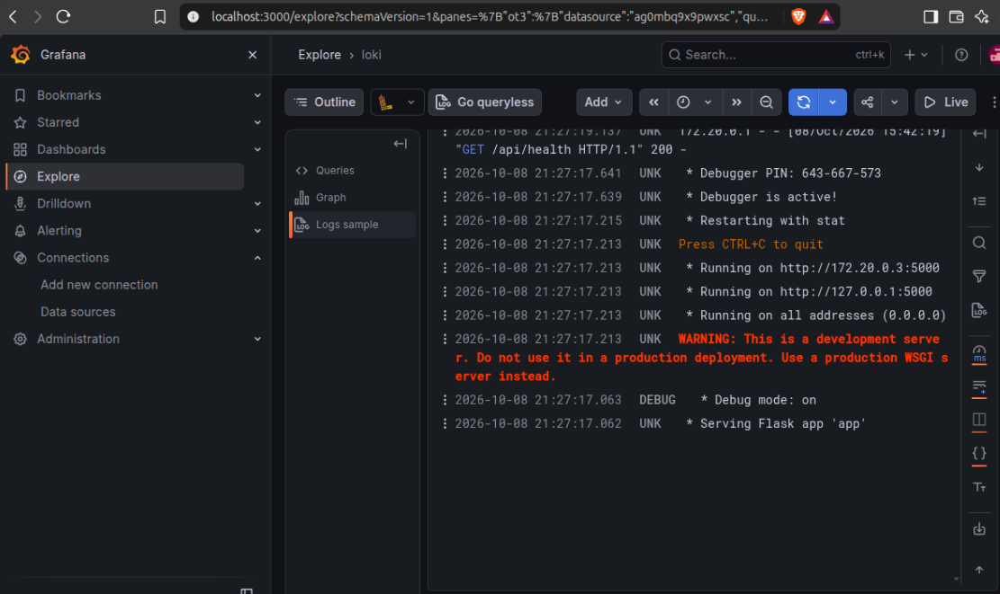

---

# 10. Security & Configuration

Configuration values are stored in environment variables instead of hard-coding them in the application source.

The project uses a `.env` file for local configuration.

Example:

```env
POSTGRES_DB=devops_task_manager
POSTGRES_USER=devops_user
POSTGRES_PASSWORD=<your-password>
DB_HOST=host.docker.internal
DB_PORT=5432
REDIS_HOST=redis
REDIS_PORT=6379
```

# 11. Troubleshooting

The project also includes practical troubleshooting demonstrations for common DevOps problems.

## 11.1 Nginx 502 Bad Gateway

### Problem

A 502 usually means Nginx cannot get a valid response from the backend service it is forwarding requests to.

### Troubleshooting steps

Check the backend container:

```bash
docker compose ps
```

Check backend logs:

```bash
docker compose logs backend --tail=100
```

Check the backend directly:

```bash
curl http://localhost:5000/api/health
```

Check Nginx configuration:

```bash
sudo nginx -t
```

Check the Nginx service:

```bash
sudo systemctl status nginx
```

After fixing the backend or Nginx connection, reload Nginx:

```bash
sudo systemctl reload nginx
```


> **Screenshot 20 — Nginx 502 troubleshooting**  
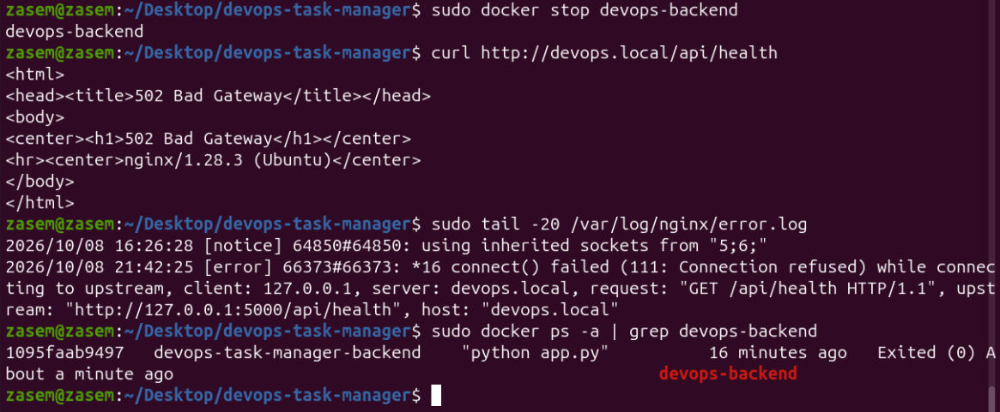
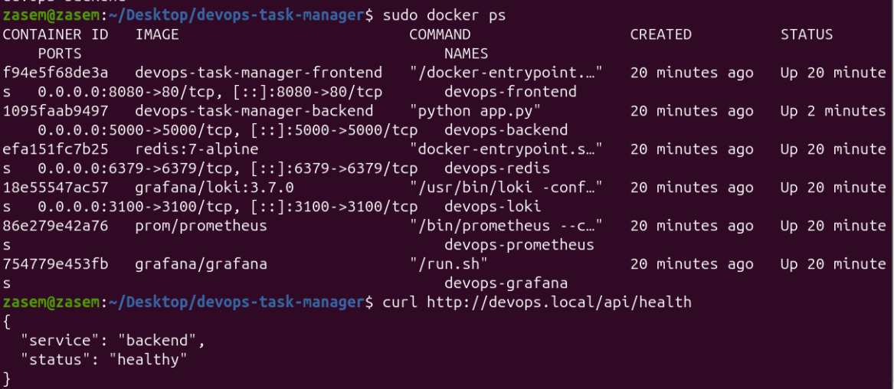

---

## 11.2 Backend unable to connect to Redis

### Troubleshooting steps

Check Redis:

```bash
docker compose ps redis
```

Check Redis logs:

```bash
docker compose logs redis --tail=50
```

Check backend Redis variables:

```bash
docker exec devops-backend env | grep -E 'REDIS_HOST|REDIS_PORT'
```

Test Redis from the backend container:

```bash
docker exec devops-backend python -c "import redis; r=redis.Redis(host='redis',port=6379); print(r.ping())"
```


The expected result is:

```text
True
```


Correct settings are:

```env
REDIS_HOST=redis
REDIS_PORT=6379
```

The service name `redis` is used because Docker Compose provides service-name based networking.

---

## 11.3 Backend unable to connect to PostgreSQL

PostgreSQL is running directly on the Linux VM.

### Troubleshooting steps

Check PostgreSQL service:

```bash
sudo systemctl status postgresql
```


Check port `5432`:

```bash
sudo ss -lntp | grep 5432
```

Check the PostgreSQL listening address:

```bash
sudo -u postgres psql -Atc "SHOW listen_addresses;"
```

Check the PostgreSQL access file:

```bash
sudo -u postgres psql -Atc "SHOW hba_file;"
```

Check the Docker-to-host connection from the backend:

```bash
docker exec devops-backend python -c "import socket; s=socket.create_connection(('host.docker.internal',5432),5); print('PostgreSQL PORT OPEN'); s.close()"
```

Check the database login from the backend:

```bash
docker exec devops-backend python -c "import os,psycopg; psycopg.connect(host=os.getenv('DB_HOST'),port=os.getenv('DB_PORT'),dbname=os.getenv('POSTGRES_DB'),user=os.getenv('POSTGRES_USER'),password=os.getenv('POSTGRES_PASSWORD')).close(); print('POSTGRES CONNECTION OK')"
```

Important settings:

```env
DB_HOST=host.docker.internal
DB_PORT=5432
```

The PostgreSQL access configuration allows the Docker network to connect to the required database and user.

---

## 11.4 CI/CD succeeds but the old application version is still running

### Troubleshooting idea

Check running containers:

```bash
docker ps
```

Check the image used by the backend container:

```bash
docker inspect devops-backend --format 'Image={{.Image}}'
```

List available images:

```bash
docker images
```

Check the deployment stage in `Jenkinsfile`.

A deployment should recreate or restart the application using the latest image.

For a Compose based deployment, a useful command is:

```bash
docker compose up -d --build --force-recreate
```

Then verify the live application:

```bash
curl http://localhost:5000/api/tasks
```

This confirms that the running container is serving the current application version.

---

## 11.5 Application issue using Grafana metrics and logs

Grafana helps identify problems by showing resource use and application activity.

### Example investigation

A slow application can be checked in this order:

```text
Application appears slow
        |
        v
Check Grafana metrics
        |
        v
Check CPU / Memory / Network
        |
        v
Find the affected container
        |
        v
Check Docker stats
        |
        v
Check container processes and logs
        |
        v
Fix the cause
        |
        v
Check the metrics again
```

Useful commands:

```bash
docker stats --no-stream
docker top devops-backend
docker compose logs backend --tail=100
```

For a controlled test, CPU usage can be monitored from Grafana and Docker statistics, then checked again after the workload is removed.

The main idea is to use both:

- **Metrics** to understand resource usage
- **Logs** to understand application activity

> **Screenshot 21 — Grafana troubleshooting**  
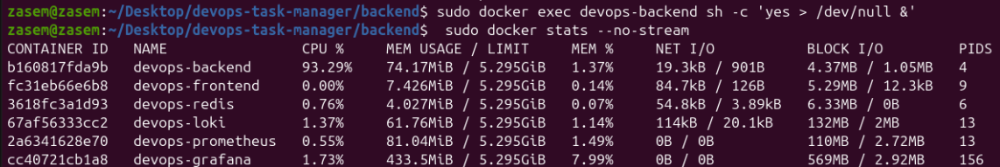


> **Screenshot 22 — Troubleshooting logs**  
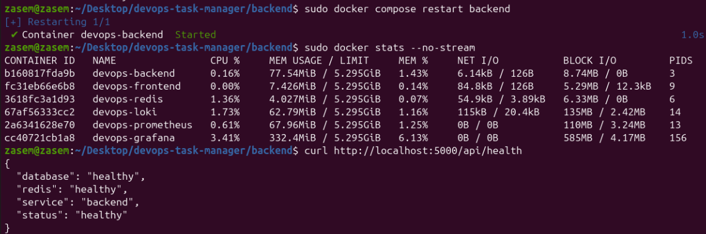

---

# 12. Deployment Steps

The complete deployment process is:

## Step 1 — Get the source code

```bash
git clone https://github.com/iamzasem/devops-task-manager-app.git
cd devops-task-manager
```    

## Step 2 — Prepare environment variables

Create `.env`:

```env
POSTGRES_DB=devops_task_manager
POSTGRES_USER=devops_user
POSTGRES_PASSWORD=**********
DB_HOST=host.docker.internal
DB_PORT=5432
REDIS_HOST=redis
REDIS_PORT=6379
```

## Step 3 — Install PostgreSQL on the VM

Make sure PostgreSQL is installed and running directly on the Linux VM.

```bash
sudo systemctl enable postgresql
sudo systemctl start postgresql
```

## Step 4 — Start the Docker services

```bash
docker compose up -d --build
```

## Step 5 — Verify containers

```bash
docker compose ps
```

## Step 6 — Verify application health

```bash
curl http://localhost:5000/api/health
```

## Step 7 — Check Nginx

```bash
sudo nginx -t
sudo systemctl reload nginx
```

## Step 8 — Open the application

```text
http://devops.local
```

## Step 9 — Check monitoring

Open Grafana and review the configured dashboards.

## Step 10 — Check logs

Open Grafana Explore and select Loki to view application/container logs.

---

The setup is designed to be simple to run on a Linux VM while still showing the main practices expected in a basic DevOps project.
